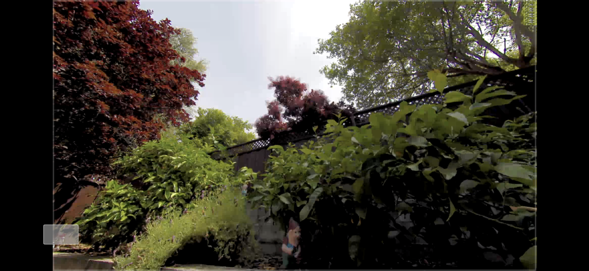
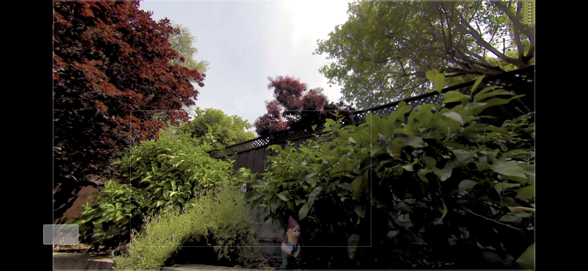

# UIView zooming/transitioning and custom layouting
Demo of UIView full-screen transitioning / zooming, and custom layouting of UIViews list.

In this project I would cover some architecture challenges/problems developer facing when designing application to manage collection of video players to play as recordings, such to play real time streaming utilizing native player or custom one.

I do not introduce bicycle here, it is mostly like a helpful tips for them who are going implement zooming/scaling video playback, implement custom transitioning to/from full-screen, and manage multiple playbacks at the same time.

First, from what I would like to start, it is dept how to represent list of playbacks.
It depends on, 
if it is just application like a youtube or library of recordings, probably you will not want to allow playing simultaneously a few players, since it is not common user experience for such cases. Then probably you will need one, maximum two players a time. And what actually you need to show for user it is list of recordings with thumbnails each of them. And general ***UIViewCollection*** works well here.

But e.g. if it is kind of monitoring system, like a nest, ring then probably you would like to show up multiple live streams a time, that user could monitor securable area. But actually from my perspective monitoring more then 10 – 20 video streams became pretty difficult an especially from mobile device, honestly saying I don’t think human can actually keep tracking more than a couple streams a time, it is physically hard, at this point much better to use such solution like, detection of motions/sounds/objects and so on, and notify about event over some notification system like a push notifications, real time alert and so on. 
But I went far away from objective of topic. So, if you want to allow monitoring simultaneously multiple streams, then probably you need implement custom collection to suppress such features of default one (***UIViewCollection***) like reusing view cells, to avoid such behavior like caching currently playing players and re-add to cell on scrolling, because it can cause small hanging on of UI and small degradation on performance. And like I said above if it is just a few devices to monitor and actually just 1-5 is going to be played a time, then it is much better to implement custom collection based on custom layout. It is not hard at all, in the project I have an example of such layout, it is simple and adaptive to screen size and size of cells, also it will try to place player widgets compactly as much as possible. 
Basically, here is nothing extraordinary, just probably tip is to looking into existing interface of collectionviewlayout and try to design similar, since it is pretty much well designed.

```swift
protocol CollectionViewLayoutProtocol: class {
    var itemSpace: CGFloat { get set }
    var boundaryMargin: CGFloat { get set }
   
    var contentSize: CGSize { get }
    
    init(layoutDelegate: ViewControllerLayoutDelegate)
    
    func performLayout(_ size: CGSize)
    func itemFrame(for index: Int) -> CGRect
}
```
```swift
var itemSpace: CGFloat { get set }
var boundaryMargin: CGFloat { get set }
```
the properties define a spacing and margin of items inside of collection of view.

```swift
var contentSize: CGSize { get }
```
is actual size of content. 

```swift
func itemRect (for index: Int) -> CGRect
```
gives the info about where to place item in content view. It returns size of item and center of rect in parent coordinate system.
And collectionview has to adopt delegate to respond for request about item size and number of items. 
```swift
protocol CollectionViewLayoutDelegate: class {
    var itemsCount: Int { get }
    
    func itemSize(index: Int, widthConstrained: CGFloat) -> CGSize
}
```
i.e. pretty much similar what ***UICollectionViewFlowLayout*** does.

Next topic which I would like to cover here is *zooming/scaling* and *dragging* of video view. I would like to talk about challenges like, *proportionally scaling* of player widget view, when  bounds size is changing (e.g. on screen rotation from portrait to landscape), *keeping right position of selected area* when re-bounds happened, adding cropped video stream into picture so it could be looking like picture in picture.
So first what I would recommend do not use frame properties of view since it is undefined on transformation, instead of use center, bounds and transform properties, all of them give the information child position and size relatively to parent, then a lot of examples recommends to use center property of view when dragging, I would recommend to use translate of transform property to keep matrix transformation up to date, since probably you will not just moving also scaling and probably rotate and it will help simply update transformation by multiplying another transformation matrix and resetting to initial state whole transformation when it is needed.
If you take a look at ***ZoomViewController*** then method  ***viewDidResize(_ size: CGSize)*** gives an information how to rebounds content view and properly scale children to get finally something what ***contentMode*** property of ***UIImageView*** does when it is set to ***scaleAspectFit*** and at the same time keep the position of children if they were *scaled/dragged* inside of content view. Handlers pinchHandler and panhandler give an idea how to properly transform children views and keep them in bounds of content view.

Advanced topic, it is how to represents cropped picture inside of the full frame picture. 
Let’s assume, you have a full frame image, and now you could get cropped image of some area of full framed pictures with the same resolution, it is clear that it will looks like a zoom, I.e. the cropped picture will be more clear and detailed, now assume you can get frame of the new image relatively to fullframed picture (it is possible and depends how you took the image). And now it would be cool to place the cropped image inside of fullframed in exact place. Actually it is easily if original image is not transformed, but a bit tricky when it is. 
In ***ZoomViewController*** you can find method which get crop of selected area, It is ***zoomInfo()*** the method calculate frame of the selected area of the transformed view and frame of the destination area from where picture will be taken relatively to resolution of the destination. And ***ZoomModel*** class is responsible to send frame to destination, take new frame and calculate frame to apply cropped picture inside of fullframed. 
To see how it works I added snapshots.

***Full framed image***
<p align="center">

</p>

***Digitally Zoomed image***
<p align="center">

</p>

***HD Zoomed image***
<p align="center">

</p>

***Zoom out, zoomed image insixe of full framed image***
<p align="center">

</p>

And last topic which I would cover here is transition from widget view to fullscreen view and back to exact in the same place from where it was fullscreened.
Here is nothing complicated and UIKit framework provide whole set of classes to do that, just a few tips.
First, I would recommend for the feature to adopt ***coordinator*** pattern, it will make code clean and readable. The class will need to adopt ***UIViewControllerTransitioningDelegate*** delegate and in my implementation have a references to widget view controller from where it will be transitioning to fullscreen, fullscreen controller and view controller who actually is transformed.
Both classes fullscreen controller and widget controller adopt protocol which will be used by implementation of ***UIViewControllerAnimatedTransitioning*** to get info from where and to where perform transitioning. Actually the info can be gathering over transitioning context, but problem is that, that uikit manage source and destination controllers and it is not always what you want.


